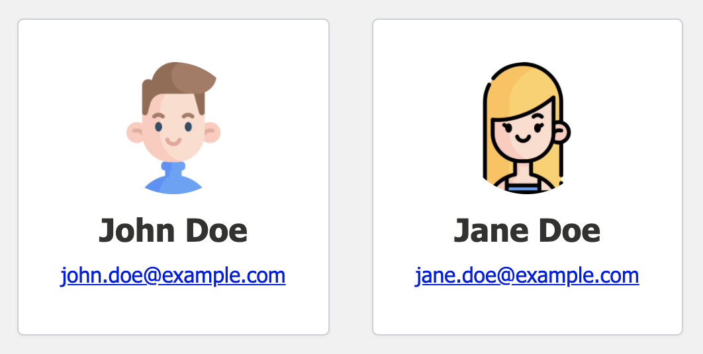

[](https://forthebadge.com)

#JavaScript Fetch API example

Suppose that you have a `json file` that locates on the webserver with the following contents:

```json
[{
        "username": "john",
        "firstName": "John",
        "lastName": "Doe",
        "gender": "Male",
        "profileURL": "img/male.png",
        "email": "john.doe@example.com"
    },
    {
        "username": "jane",
        "firstName": "Jane",
        "lastName": "Doe",
        "gender": "Female",
        "profileURL": "img/female.png",
        "email": "jane.doe@example.com"
    }
]
```

The following shows the `HTML page`:

```html
<!DOCTYPE html>
<html lang="en">
<head>
    <meta charset="UTF-8">
    <meta name="viewport" content="width=device-width, initial-scale=1.0">
    <title>Fetch API Demo</title>
    <link rel="stylesheet" href="css/style.css">
</head>
<body>
    <div class="container"></div>
    <script src="js/app.js"></script>
</body>
</html>
```

In the `app.js`, we’ll use the `fetch() method` to get the user data and **render the data** inside the `<div> element` with the `class container`.

First, declare the `getUsers() function` that fetches `users.json` from the **server**.

```js
async function getUsers() {
    let url = 'users.json';
    try {
        let res = await fetch(url);
        return await res.json();
    } catch (error) {
        console.log(error);
    }
}
```

Then, develop the `renderUsers() function` that **renders user data**:

```js
async function renderUsers() {
    let users = await getUsers();
    let html = '';
    users.forEach(user => {
        let htmlSegment = `<div class="user">
                            
                            <h2>${user.firstName} ${user.lastName}</h2>
                            <div class="email"><a href="email:${user.email}">${user.email}</a></div>
                        </div>`;

        html += htmlSegment;
    });

    let container = document.querySelector('.container');
    container.innerHTML = html;
}

renderUsers();
```

###Output


